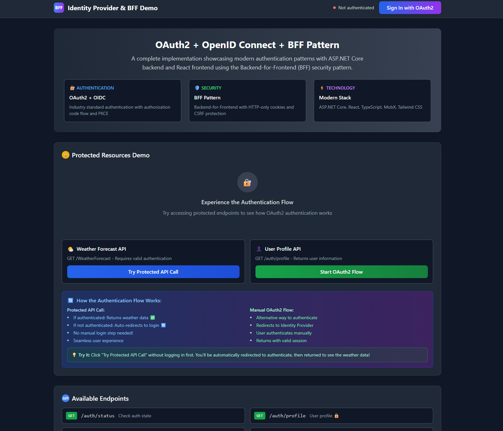

# Identity BFF (Backend for Frontend)

A comprehensive Backend for Frontend (BFF) implementation demonstrating OIDC/OAuth2 authentication patterns with a React frontend. This project showcases best practices for secure authentication flows between a client application, BFF, and Identity Provider.



## 🎯 Project Overview

This BFF implementation was developed as a practical learning exercise to understand and implement the **Backend for Frontend** pattern with OpenID Connect and OAuth 2.0. It demonstrates how to securely handle authentication flows while protecting sensitive tokens from browser-based vulnerabilities.

### 🔐 Authentication Flow

```
┌─────────────┐    ┌─────────────┐    ┌─────────────┐    ┌─────────────┐
│   Browser   │    │     BFF     │    │ Identity    │    │  Resource   │
│   (React)   │    │   (.NET)    │    │  Provider   │    │   Server    │
└─────────────┘    └─────────────┘    └─────────────┘    └─────────────┘
       │                   │                   │                   │
       │ 1. Request Page   │                   │                   │
       │ ──────────────────►                   │                   │
       │                   │                   │                   │
       │ 2. Redirect to    │                   │                   │
       │    Identity       │                   │                   │
       │ ◄─────────────────┤                   │                   │
       │                   │                   │                   │
       │ 3. User Login     │                   │                   │
       │ ──────────────────┼──────────────────►│                   │
       │                   │                   │                   │
       │ 4. Auth Code      │                   │                   │
       │ ◄─────────────────┼───────────────────┤                   │
       │                   │                   │                   │
       │ 5. Code Exchange  │                   │                   │
       │ ──────────────────► 6. Token Exchange │                   │
       │                   │ ──────────────────►                   │
       │                   │                   │                   │
       │                   │ 7. Tokens         │                   │
       │                   │ ◄─────────────────┤                   │
       │                   │                   │                   │
       │ 8. Session Cookie │                   │                   │
       │ ◄─────────────────┤                   │                   │
       │                   │                   │                   │
       │ 9. API Calls      │                   │                   │
       │ ──────────────────► 10. Authorized    │                   │
       │                   │     Requests      │                   │
       │                   │ ──────────────────┼──────────────────►│
```

## 🔧 Technical Stack

- **Backend:** .NET 9 Web API with minimal APIs
- **Frontend:** React 18 + TypeScript + Vite
- **Styling:** Tailwind CSS
- **State Management:** MobX
- **Authentication:** OpenID Connect with PKCE
- **Security:** HTTP-only cookies, CORS protection
- **Development:** Hot reload, proxy configuration

## 🚀 Features Implemented

### Core BFF Features
- ✅ **Authentication Proxy** - Handles OIDC flows on behalf of the frontend
- ✅ **Token Management** - Secure server-side token storage
- ✅ **Session Management** - HTTP-only cookie-based sessions
- ✅ **API Proxy** - Forwards authenticated requests to resource servers
- ✅ **CORS Protection** - Secure cross-origin request handling

### Security Features
- ✅ **PKCE Implementation** - Proof Key for Code Exchange
- ✅ **Secure Cookie Storage** - HTTP-only, SameSite cookies
- ✅ **Token Refresh** - Automatic access token renewal
- ✅ **CSRF Protection** - Cross-site request forgery protection
- ✅ **Origin Validation** - Strict origin checking

### Developer Experience
- ✅ **Hot Reload Development** - Both frontend and backend
- ✅ **Proxy Configuration** - Seamless API integration
- ✅ **OpenAPI Documentation** - Swagger integration
- ✅ **TypeScript Support** - Full type safety
- ✅ **Modern Tooling** - Vite, ESLint, Tailwind CSS

## 🏗️ Architecture

The BFF pattern provides several advantages:

### **Why BFF?**
1. **Token Security** - Sensitive tokens never reach the browser
2. **Simplified Frontend** - Client doesn't handle complex auth flows
3. **Centralized Security** - All security logic in one place
4. **API Aggregation** - Combine multiple backend services
5. **Protocol Translation** - Handle different authentication protocols

### **Project Structure**
```
├── src/
│   └── Identity.Bff.Api/               # BFF API Server
│       ├── Configuration/              # Authentication & CORS config
│       ├── Endpoints/                  # API endpoints
│       ├── Experimental/               # Custom OIDC handler
│       └── Program.cs                  # Application setup
├── samples/
│   └── WebService/                     # React Frontend
│       ├── src/
│       │   ├── components/             # React components
│       │   ├── contexts/               # React contexts
│       │   ├── services/               # API service layer
│       │   ├── stores/                 # MobX stores
│       │   └── utils/                  # Utility functions
│       └── package.json                # Frontend dependencies
└── Scripts (PowerShell)               # Development scripts
```

## Quick Start

### Individual Services

- **Start BFF API Only:**
  ```powershell
  .\start-server.ps1
  ```
  Starts the .NET BFF API on `https://localhost:7108`

- **Start Web Frontend Only:**
  ```powershell
  .\start-web.ps1
  ```
  Starts the React frontend on `http://localhost:3000`

## 📋 Prerequisites

- .NET 9.0 SDK or later
- Node.js (v18 or higher)
- **Identity Provider** running on `http://localhost:5043`
- PowerShell (Windows) or any terminal

## ⚙️ Configuration

### BFF API Configuration (appsettings.json)

```json
{
  "Authentication": {
    "Authority": "http://localhost:5043",
    "ClientId": "bff-client",
    "ClientSecret": "your-client-secret",
    "ResponseType": "code",
    "Scope": "openid profile api",
    "CallbackPath": "/signin-oidc",
    "RequireHttpsMetadata": false
  },
  "Cors": {
    "AllowedOrigins": ["http://localhost:3000"],
    "AllowCredentials": true
  }
}
```

### Frontend Environment (.env)

```env
VITE_API_BASE_URL=https://localhost:7108
```

## 📡 API Endpoints

### Authentication Endpoints
- `GET /auth/login` - Initiate login flow
- `GET /auth/logout` - Initiate logout flow
- `GET /auth/user` - Get current user info
- `POST /auth/refresh` - Refresh access tokens

### Proxy Endpoints
- `GET /api/*` - Proxied API calls to resource servers
- `GET /weatherforecast` - Sample protected endpoint

### Utility Endpoints
- `GET /swagger` - API documentation (Development)
- `GET /health` - Health check endpoint

## 🔐 Security Implementation

### Token Handling
- **Access tokens** stored server-side only
- **Refresh tokens** used for automatic token renewal
- **Session cookies** for client-server communication
- **PKCE** for additional security in the auth flow

### CORS Security
- Strict origin validation
- Credential inclusion for authenticated requests
- Proper preflight handling

### Cookie Security
- HTTP-only cookies (prevent XSS)
- SameSite protection (prevent CSRF)
- Secure flag in production
- Proper domain and path settings

## 🔗 Integration with Identity Provider

This BFF is designed to work with the [Identity Provider project](../idp-server-dotnet/):

1. **Start the Identity Provider** first
2. **Configure the BFF** to point to the IdP
3. **Register the BFF** as a client in the IdP
4. **Start the BFF and frontend**

### Required IdP Client Configuration

```json
{
  "bff-client": {
    "ClientId": "bff-client",
    "RedirectUri": "https://localhost:7108/signin-oidc",
    "Scopes": ["openid", "profile", "api"],
    "RequirePkce": true
  }
}